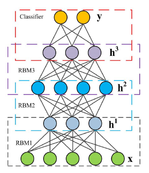

# CNN-based bearing fault classifier
```
Specifically, the 1-D temporal raw data obtained from different accelerometers are firstly 
stacked to 2-D vector form similar to the representation of images, which is then passed over 
to a convolutional layer for feature extraction, followed by a pooling layer for downsampling.
The combination of this convolution-pooling pattern is repeated many times to further deepen the network. 
Finally, the output from the hidden layers will be handed over to one or several fully-connected layers, 
the result of which is transferred to a top classifier based on Softmax or Sigmoid functions to determine 
if a bearing fault is present.


具體來說，首先將從不同的加速度計(accelerometer)獲得的一維時間原始數據(1-D temporal raw data)
堆疊為類似於圖像表示的二維矢量形式(2-D vector)，
然後將其傳遞到卷積層(convolutional layer)以進行特徵提取，然後傳遞到池化層(pooling layer)以進行*降採樣(downsampling)。
多次重複此卷積池模式的組合，以進一步加深網絡。 最後，來自隱藏層(hidden layer)的輸出將移交給一個或幾個完全連接的層，
其結果將基於Softmax或Sigmoid函數傳輸到頂部分類器，以確定是否存在軸承故障。

*downsampling https://zh.wikipedia.org/wiki/%E9%99%8D%E9%87%87%E6%A0%B7
```

```
To obtain a better trade-off between the training speed and accuracy, an adaptive CNN (ADCNN) is applied on 
the CWRU dataset to dynamically change the learning rate. 
The entire fault diagnosis model employs a fault pattern determination component using 1 ADCNN and 
a fault size evaluation component using 3 ADCNNs, and 3-layer CNNs with max pooling. 


為了在訓練速度和準確性之間取得更好的平衡，將自適應CNN（ADCNN）應用於CWRU數據集以動態更改學習率。
整個故障診斷模型採用使用1個ADCNN的故障模式確定組件和使用3個ADCNN的故障大小評估組件以及具有max poling的3層CNN。
```
```
Many variations of CNN are also employed to tackle the bearing fault diagnosis challenge 
using the CWRU dataset to obtain more desirable characteristics than conventional CNN.


使用CWRU數據集，也可以使用CNN的許多變體來應對軸承故障診斷挑戰，以獲得比常規CNN更理想的特性。
```


# Auto-encoders
```
Auto-encoder is proposed in the 1980s as an unsupervised pre-training method for ANNs.
The auto-encoder  become widely adopted as an unsupervised feature learning method and a greedy layer-wise 
neural network pre-training method.
An auto-encoder is trained from an ANN,which consists of two parts: the encoder and the decoder.
The output of the encoder is fed into the decoder as input.


自動編碼器是在1980年代提出的，是一種無監督的人工神經網絡預訓練方法。
自動編碼器已被廣泛用作無監督特徵學習方法和貪婪的分層神經網絡預訓練方法。 說明了具有1個隱藏層的自動編碼器的訓練過程。
從ANN訓練自動編碼器，它由兩部分組成：編碼器和解碼器。
編碼器的輸出作為輸入饋入解碼器。
```


# Deep Belief Network(DBN)
```
A deep belief network (DBN) can be viewed as a composition of simple unsupervised networks such as 
restricted Boltzmann machines or auto-encoders, where each sub-network’s hidden layer serves as the visible 
layer for the next, as illustrated by different colored boxes. 
An RBM is an undirected generative energy-based model with a "visible" input layer, a hidden layer, and connections 
in between, but not within layers. This composition leads to a fast layer-by-layer unsupervised training procedure, 
where contrastive divergence is applied to each sub-network in turn,starting from the "lowest pair of 
layers in the architecture.


深度信任網絡（DBN）可以看作是簡單的無監督網絡的組成，
例如*受限玻爾茲曼機(restricted Boltzmann machines)或自動編碼器，其中每個子網的隱藏層充當下一個的可見層，如不同的彩色框所示。
RBM是基於無方向生成能量的模型，具有“可見”輸入層，隱藏層以及層之間（而不是層內）的連接。
這種組合導致了快速的逐層無監督訓練過程，在此過程中，從“體系結構中的最低層對”開始依次對每個子網應用對比差異。


*restricted Boltzmann machines 
        https://zh.wikipedia.org/zh-tw/%E5%8F%97%E9%99%90%E7%8E%BB%E5%B0%94%E5%85%B9%E6%9B%BC%E6%9C%BA
```
