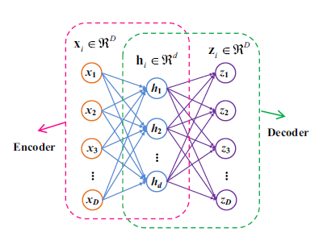

# CNN-based bearing fault classifier
```
Specifically, the 1-D temporal raw data obtained from different accelerometers are firstly 
stacked to 2-D vector form similar to the representation of images, which is then passed over 
to a convolutional layer for feature extraction, followed by a pooling layer for downsampling.
The combination of this convolution-pooling pattern is repeated many times to further deepen the network. 
Finally, the output from the hidden layers will be handed over to one or several fully-connected layers, 
the result of which is transferred to a top classifier based on Softmax or Sigmoid functions to determine 
if a bearing fault is present.


具體來說，首先將從不同的加速度計(accelerometer)獲得的一維時間原始數據(1-D temporal raw data)
堆疊為類似於圖像表示的二維矢量形式(2-D vector)，
然後將其傳遞到卷積層(convolutional layer)以進行特徵提取，然後傳遞到池化層(pooling layer)以進行*降採樣(downsampling)。
多次重複此卷積池模式的組合，以進一步加深網絡。 最後，來自隱藏層(hidden layer)的輸出將移交給一個或幾個完全連接的層，
其結果將基於Softmax或Sigmoid函數傳輸到頂部分類器，以確定是否存在軸承故障。

*downsampling https://zh.wikipedia.org/wiki/%E9%99%8D%E9%87%87%E6%A0%B7
```

```
To obtain a better trade-off between the training speed and accuracy, an adaptive CNN (ADCNN) is applied on 
the CWRU dataset to dynamically change the learning rate. 
The entire fault diagnosis model employs a fault pattern determination component using 1 ADCNN and 
a fault size evaluation component using 3 ADCNNs, and 3-layer CNNs with max pooling. 


為了在訓練速度和準確性之間取得更好的平衡，將自適應CNN（ADCNN）應用於CWRU數據集以動態更改學習率。
整個故障診斷模型採用使用1個ADCNN的故障模式確定組件和使用3個ADCNN的故障大小評估組件以及具有max poling的3層CNN。
```
```
Many variations of CNN are also employed to tackle the bearing fault diagnosis challenge [109]–[116] using the CWRU dataset to obtain more desirable characteristics than conventional CNN.


使用CWRU數據集，也可以使用CNN的許多變體來應對軸承故障診斷挑戰[109]-[116]，以獲得比常規CNN更理想的特性。
```


#Auto-encoders
